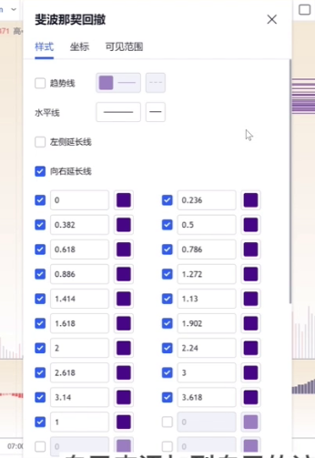
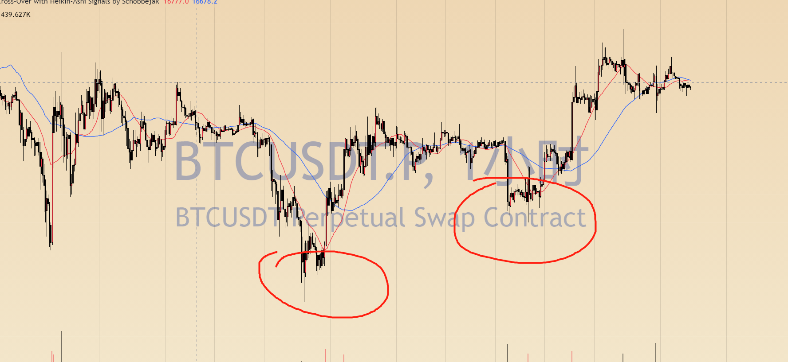
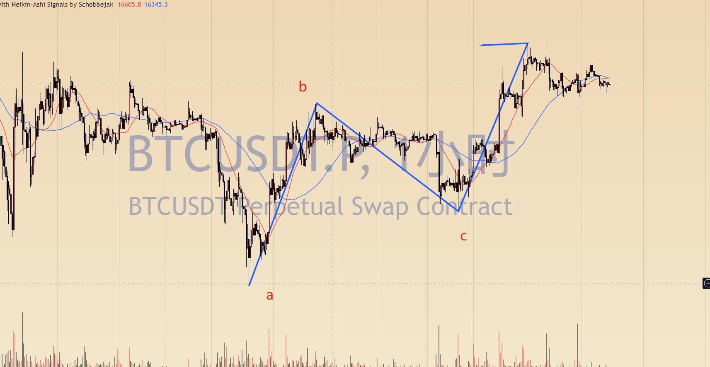

# 1 谐波交易系统的介绍

## 1.1 ESP法则

ESP法则说的是，在交易的时候，需要知道以下三个价格：

- 入场价。根据根据交易系统，确定自己的入场点
- 止盈价。根据自己的交易系统，或者交易习惯，要知道自己这笔交易，自己的止盈价格在什么位置出场
- 止损价。根据自己的交易系统，设置一个止损价格，当市场来到这个价格的时候，果断选择离场，为这笔交易买单

## 1.2 简介

谐波是一个叫加特利的美国人，研发出了第一个谐波形态，为了纪念这个人，把他创造出来的这个形态称为，加特利形态。

当年加特利出了一本交易相关的书，里面第一次提到了这个形态的名字，且这个形态出现在书本的222页，所以后来的人也称这个形态为222形态。

之后的所有形态基本以动物命名。

后来对谐波有重大贡献的一个人的名字叫做斯科特卡尼，也是一个美国人，近年来又研究发表了其他很多的谐波形态。并且在加特利的基础之上完善了加特利形态。发表包括蝙蝠，鲨鱼，螃蟹等等谐波形态，这个后面会提到。

斯科特卡尼，完善了整个谐波交易系统，所以说，加特利是谐波的创始人，真正讲谐波总结为一套完善的交易系统的是斯科特卡尼这个人。

谐波理论的官方网站

`https://harmonictrader.com/`

上面有详细的文字谐波教程，youtube上也有他本人的视频教程

## 1.3 学习之前的准备

tv关于斐波那契的设置，如下图所示：

# 2 AB=CD 谐波中唯一的四点形态

## 2.1 谐波形态的起点选择

当在k线图上寻找谐波时，首先要寻找起点，通过起点开始画谐波交易系统。那么如何寻找起点呢？

一般谐波形态的起点为一段趋势的拐点，如图所示：

上图所示中的两个红圈位置都可以被称为拐点，一般以拐点作为谐波形态的起点，既x点。

## 2.2 谐波形态的c点选择

当一段行情出现n形上涨趋势，择可以直接画出abc三个点的坐标

如下图所示：

类似在任何图上都可以找到如上图所示的abc的形态，这只是一个雏形，下一步我们应该来验证一下这个c点是否满足abcd的形态。

c点需要满足在从a到b的0.382-0.886这个区间才能成立，上图也是满足这个条件的。

## 2.3 ab=cd的d点选择

- 从a到b画一条线，连接a点与b点
- 将这个点从a点平移，移动到c点，以c点作为起点，这条线最高的位置就是d点
- 再通过斐波那契数扩展工具，由b点到c点
- 找到bc的斐波那契扩展的1.618这个位置
- 然后1.618的位置和d点这个价格差，就是ab=cd形态的反转区间
- d点在1.618之上，d到上方斐波那契扩展线为反转区间
- d点在0.618之下。d到下方斐波那契最近扩展线为反转区间

## 2.4 ab=cd形态需要注意的点

ab=cd形态是最基础的谐波形态，基本所有形态由这个形态转变而来。是必须要掌握的形态

ab=cd反转力度较弱，选择在大级别上采取这种形态，会提高胜率

## 2.5 ab=cd的止盈

斐波那契扩展。连接ad

斐波那契扩展的0.382为第一止盈目标

斐波那契扩展的0.618为第二止盈目标

# 3 加特利形态

# 3.1 b点的选择

加特利形态的b点，至少要超过xa的0.618，且不能超过xa的0.786

## 3.2 c点的选择

c点区间位于ab的0.382到0.886之前

## 3.3 d点的选择

- 连接ab点，画出一条直线
- 将这条直线平移到c点
- 末端标记为d点
- 观察d点是否超过了xa的0.786，如果没有超过xa的0.786则为正常的加特利形态
- 连接d点与ab的0.786的区间，这个区间就是正常加特利形态的反转区域

## 3.4 终极k线（TB）

什么是终极k线？

当价格第一次完全突破谐波的反转区的时候，这个价格所产生的k线，我们称为终极k线

缩写为TB

**当终极k线出现的时候才能选择进场交易**

## 3.5 止损

加特利形态的标准止损位置在xa的1.13

## 3.6 变异加特利形态

- 变异加特利和正常加特利形态的区别是d点
- 当平移出现后的d点超过xa的0.786时，连接d点与xa的0.886
- 这个反转区为变异加特利的反转形态

# 4 蝙蝠形态

## 4.1 简介

蝙蝠形态其实是所有谐波形态中最常见的形态

蝙蝠形态同样也存在变异形态

## 4.2 b点的选择

b必须要大于xa的0.382，小于0.618

## 4.2 c点的选择

c点要位于ab的0.382到8.886之间，超过886其实也是没关系的

## 4.3 d点的选择

- 第一条基准线位于xa的0.886的位置，1.13为第二条
- 画bc的扩展线，对于xa的两个扩展，0.886、1.13这两个位置，必须大于bc扩展的1.618才能将之称为扩展线
- 画出abc的扩展，找出距离上一条要求的基准线中，最近的斐波那契线
- 连接这个区间就是蝙蝠形态的prz
- 如果bc的1.618大于0.886那基准线就是abc的扩展，为变异蝙蝠形态

# 5 蝴蝶形态

## 5.1 蝴蝶形态的b点选择

b点要至少位于xa的0.786，小于0.886

## 5.2 c点的选择

c点和前几个形态一样

## 5.3 d点的选择

- d点，第一条基准线位于xa的1.272，第二条位于1.414
- 画出bc的扩展，小于1.618，上面两条基准线才能成立
- 再画出abc的扩展线
- 找出这三条线重合的区间，这个区间为prz
- 蝴蝶形态的止损在xa的1.618这个位置

## 6 螃蟹形态

螃蟹形态一般出现于行情特别极端的时候

往往是加特利，蝙蝠这些形态都失效之后，我们去看的一个形态

螃蟹的d点完成点一般非常的极端

## 6.1 b点的选择

b点的位置在0.382与0.618之间

## 6.2 d点的选择

- xa的1.618为螃蟹的第一条基准线
- 基准线必须大于bc的2.24，且小于或者在3.618附件
- 连接基准线附近的斐波那契，这个区域就是螃蟹的prz

## 6.3 止损的设置

止损在xa的2.24

## 6.4 深海螃蟹形态

深海螃蟹的形态，b点可以触摸0.886这个位置

# 7 鲨鱼形态与塞弗

## 7.1 鲨鱼形态b点的选择

b点无要求，在xa中即可

## 7.2 鲨鱼形态的c点

c点高于a点即可，小于1.902

## 7.3 鲨鱼形态的d点

- ac的扩展线的0.886，1.0，1.13为三条基准线
- bc扩展的1.618必须小于上面的基准线，如果没有小于，则上方的基准线不成立，不构成prz反转区

## 7.4 鲨鱼形态的止损

鲨鱼的标准止损在xa的1.272

## 7.5 鲨鱼形态的止盈

标准止盈1：cd的0.5

标准止盈2：cd的0.886

个人操作习惯，0.382作为第一止盈
